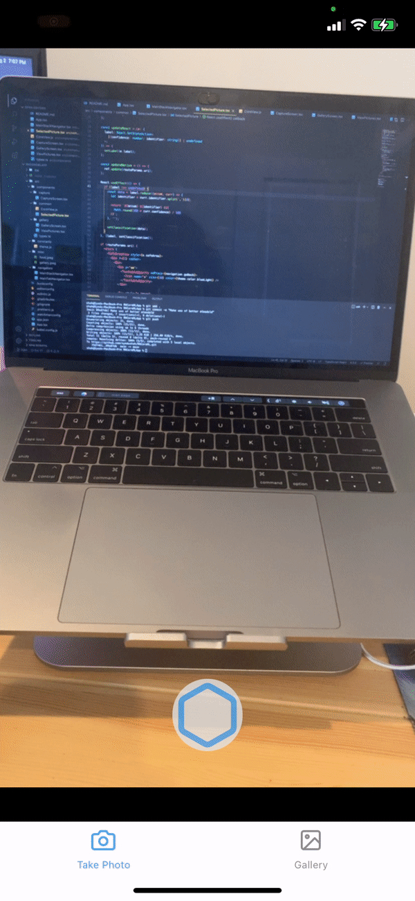
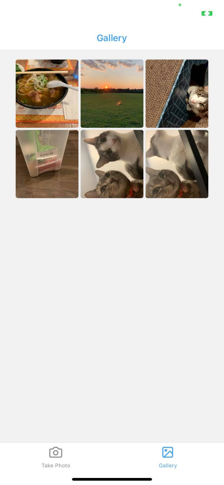
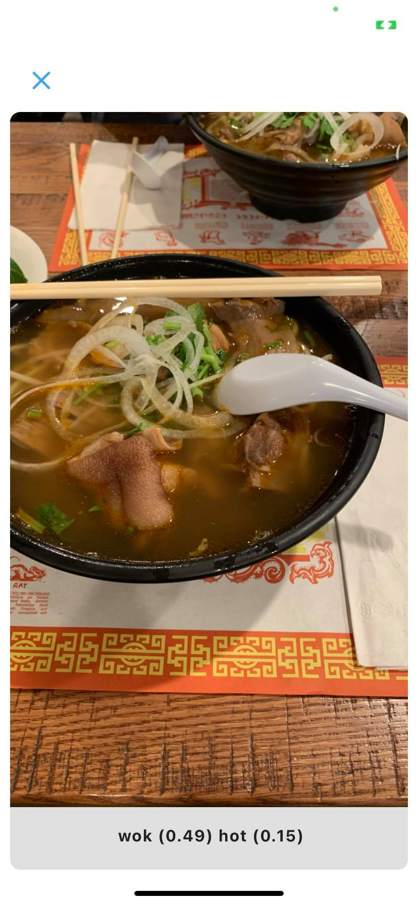

# RNCoreML

Take a picture from your phone or select one from your gallery, then let the app classify it!

To use all the features you will most likely need to run this on a physical device.

If you need help running on a physical device, please refer to
https://reactnative.dev/docs/running-on-device

Simply clone the repo, and from the root project directory run:

```
yarn
```

```
npx pod-install
```

Open up RNCoreMLApp.xcworkspace and build the project.

- Make sure you are on _.xcworkspace_
- Make sure you've selected your apple development team
- Make sure the path of the app location, under **Signing & Capabilities**, is correct. You can do so by changing _Location_ of the project to a Relative Path

When the app runs, you may need to allow access to your camera.
If you don't allow access, then you may have to change permissions from your phone's settings. Otherwise you would need to delete the app on your phone, and rebuild the project.

## Sample





